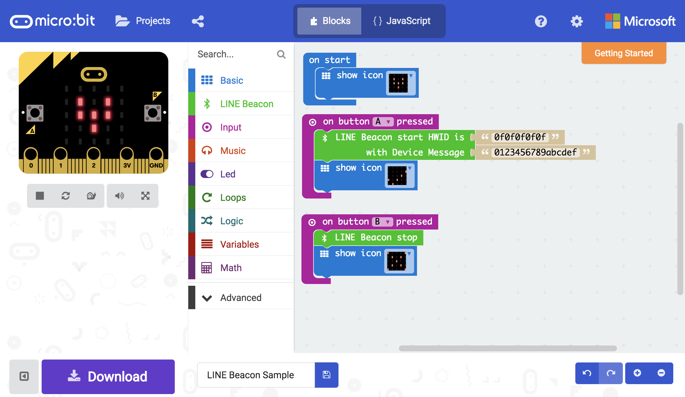

# LINE Beacon for micro:bit

[Japanese is here (日本語はこちら)](README_JP.md)

## Usage

This package makes micro:bit to LINE Beacon.

## What's LINE Beacon

LINE beacon delivers some content to LINE App on Android/iOS device using BLE. 

Users will be able to receive contents matching the place such as visiting coupons and storefront product information from LINE from the beacon installed in the store.

https://developers.line.me/en/docs/messaging-api/using-beacons/

## Quick Start

1. Register and get your HWID at https://admin-official.line.me/beacon/register
1. Add a 'LINE Beacon start' block and copy & paste your HWID (5 bytes hex).

first compile takes few minutes.

## Sample

## License

MIT

## Supported targets

* for PXT/microbit
(The metadata above is needed for package search.)

